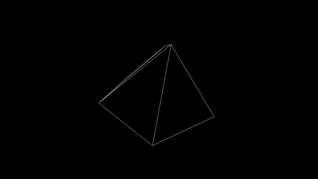
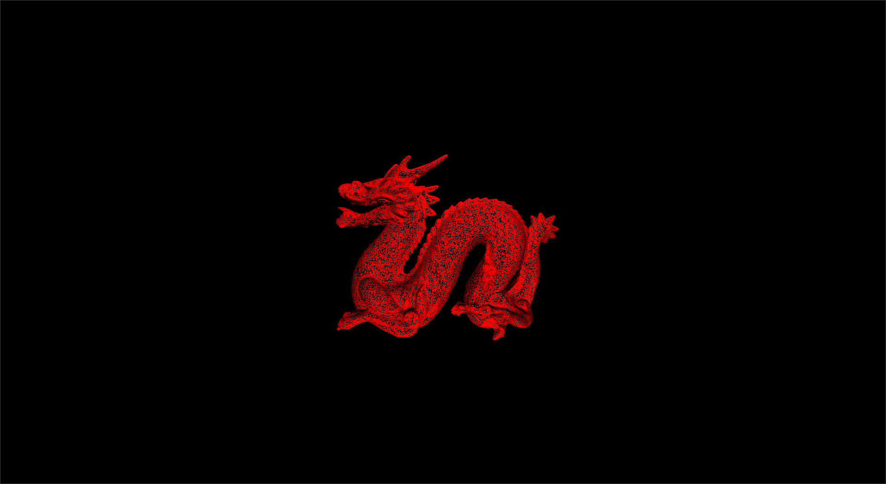
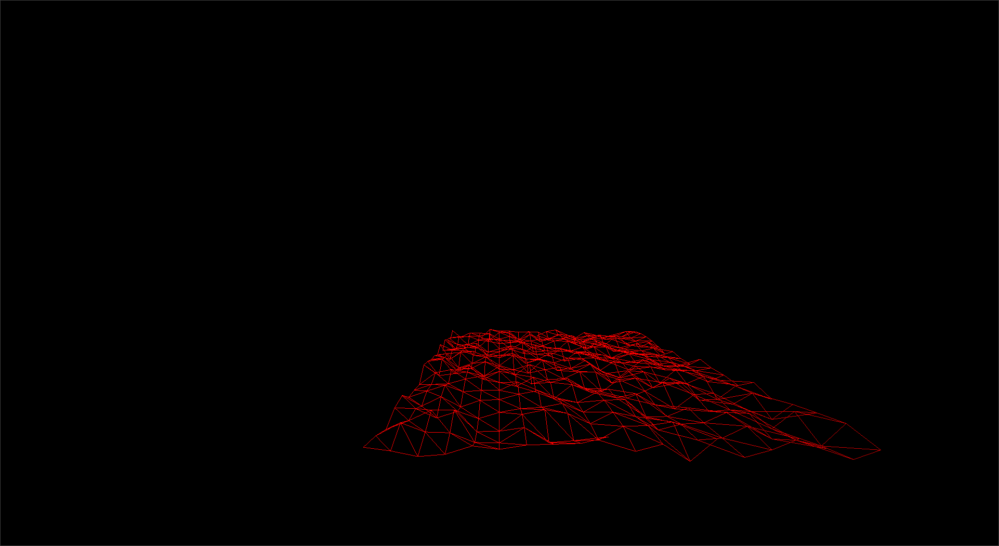

# Engine

Don't ask about the name I'm not creative, but it will change after the time hopefully

# Why?

I've started this project to first learn vulkan, but after now a bit of time I want to
start the first 3D game engine in V. I want to achieve a multi backend engine which works
on every platform.

# Roadmap
- [ ] Implement vulkan backend
- [x] Implement 3D loading
- [ ] Implement basic light
- [ ] Use multiple meshes

# Contribute
Just create a fork, create a branch and write the code. Then just push the code to your fork
and create a pull request.

# Pictures

